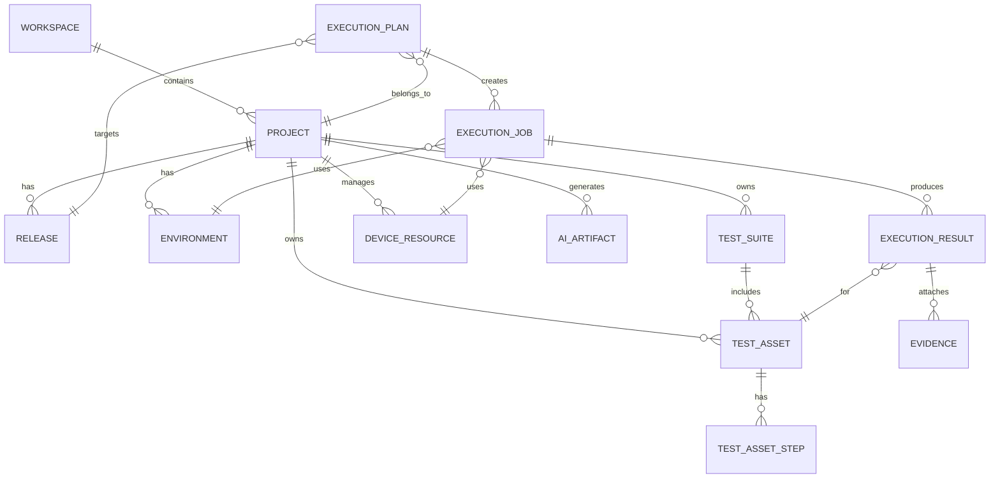

# 统一对象模型草案

## 1. 目标

这份文档的目标是把当前平台中重复建设的对象收敛成一套统一模型，为后续平台化重构提供数据基础。

核心原则：

- 平台级对象只有一套
- 自动化能力模块不再各自维护完整顶层对象
- 执行引擎作为能力适配层挂接到统一对象之下

---

## 2. 当前对象重复情况

## 2.1 Project 重复

当前至少存在以下项目对象：

- `projects.Project`
- `api_testing.ApiProject`
- `ui_automation.UiProject`
- `app_automation.AppProject`

问题：

- 无法统一权限
- 无法统一统计
- 无法统一挂接测试资产

## 2.2 Test Case 重复

当前至少存在以下用例对象：

- `testcases.TestCase`
- `ui_automation.TestCase`
- `app_automation.AppTestCase`
- `requirement_analysis.GeneratedTestCase`

问题：

- AI 生成结果无法自然沉淀到统一资产
- Web / App 自动化各自形成孤岛

## 2.3 Test Suite 重复

当前至少存在：

- `testsuites.TestSuite`
- `api_testing.TestSuite`
- `ui_automation.TestSuite`
- `app_automation.AppTestSuite`

## 2.4 Execution 重复

当前至少存在：

- `executions.TestPlan`
- `executions.TestRun`
- `ui_automation.TestExecution`
- `ui_automation.TestCaseExecution`
- `api_testing.TestExecution`
- `app_automation.AppTestExecution`

## 2.5 Report / Evidence 重复

当前报告和证据分散在：

- `reports`
- `api_testing` 里的 Allure 报告逻辑
- `ui_automation` 执行截图 / 记录
- `app_automation` 执行日志 / 截图 / Allure 报告

---

## 3. 目标对象模型

## 3.1 一级对象

建议保留以下平台级一级对象：

1. `Workspace`
2. `Project`
3. `Release`
4. `TestAsset`
5. `TestSuite`
6. `ExecutionPlan`
7. `ExecutionJob`
8. `ExecutionResult`
9. `Evidence`
10. `Environment`
11. `DeviceResource`
12. `AIArtifact`

---

## 4. 对象定义草案

## 4.1 Workspace

用于承载更高一层的隔离边界。

建议字段：

- `id`
- `name`
- `code`
- `owner_id`
- `visibility`
- `status`
- `created_at`
- `updated_at`

说明：

- 如果你未来要做团队版 / 多租户，这是必须对象
- 如果当前先不引入多租户，也建议先预留概念

## 4.2 Project

统一项目中心，替代各模块分裂的项目模型。

建议字段：

- `id`
- `workspace_id`
- `name`
- `code`
- `description`
- `project_type`
- `owner_id`
- `status`
- `created_at`
- `updated_at`

建议关联：

- `project_members`
- `releases`
- `environments`
- `test_assets`
- `execution_plans`

说明：

- 当前 `projects.Project` 最适合被升级为统一 `Project`
- `UiProject`、`AppProject`、`ApiProject` 不再作为一级对象存在

## 4.3 Release

统一版本 / 发布对象，对齐当前 `versions.Version`。

建议字段：

- `id`
- `project_id`
- `name`
- `description`
- `release_type`
- `is_baseline`
- `created_by`
- `created_at`
- `updated_at`

说明：

- 现有 `Version.projects` 是多对多
- 平台化后更建议收敛成 `Release -> Project` 一对多

## 4.4 TestAsset

这是最核心的统一对象。

它不再区分“功能用例”“UI 用例”“APP 用例”“AI 生成用例”是不同一级模型，而是统一成平台测试资产。

建议字段：

- `id`
- `project_id`
- `release_id`
- `asset_type`
- `source_type`
- `title`
- `description`
- `preconditions`
- `expected_result`
- `priority`
- `status`
- `owner_id`
- `created_by`
- `review_status`
- `tags`
- `metadata`
- `created_at`
- `updated_at`

建议枚举：

- `asset_type`
  - `manual_case`
  - `api_case`
  - `web_ui_case`
  - `app_ui_case`
  - `scenario_case`
- `source_type`
  - `manual`
  - `ai_generated`
  - `imported`
  - `recorded`

说明：

- 当前 `testcases.TestCase` 最适合作为统一 `TestAsset` 的基础
- `GeneratedTestCase` 以后不再是独立资产终点，而是 AI 草稿来源
- `ui_automation.TestCase` / `app_automation.AppTestCase` 逐步收敛为特定类型资产

## 4.5 TestAssetStep

统一测试步骤。

建议字段：

- `id`
- `test_asset_id`
- `step_no`
- `action_type`
- `action_content`
- `expected_content`
- `locator_ref`
- `component_ref`
- `input_schema`
- `assertion_schema`
- `metadata`

说明：

- 手工用例步骤、UI 步骤、APP 场景步骤都可统一收纳
- 区别放在 `action_type` 和扩展字段里，而不是拆出三套表

## 4.6 TestSuite

统一套件对象。

建议字段：

- `id`
- `project_id`
- `release_id`
- `suite_type`
- `name`
- `description`
- `created_by`
- `created_at`
- `updated_at`

说明：

- 套件下只挂 `TestAsset`
- API、Web、APP 的差异用 `suite_type` 表达

## 4.7 ExecutionPlan

替代当前通用测试计划对象。

建议字段：

- `id`
- `project_id`
- `release_id`
- `name`
- `plan_type`
- `scope_type`
- `scope_ref_id`
- `trigger_type`
- `schedule_config`
- `created_by`
- `status`
- `created_at`
- `updated_at`

说明：

- `scope_type` 可以是 `asset` / `suite`
- `trigger_type` 可以是 `manual` / `scheduled` / `api`

## 4.8 ExecutionJob

统一执行任务对象，作为真正的调度中心。

建议字段：

- `id`
- `execution_plan_id`
- `runner_type`
- `engine_type`
- `target_type`
- `target_ref_id`
- `environment_id`
- `device_resource_id`
- `requested_by`
- `status`
- `progress`
- `started_at`
- `finished_at`
- `queue_meta`
- `runtime_meta`

建议枚举：

- `runner_type`
  - `api`
  - `web_ui`
  - `app_ui`
  - `ai_browser`
- `engine_type`
  - `requests`
  - `playwright`
  - `selenium`
  - `airtest`
  - `browser_use`

说明：

- 这里统一承接当前各模块的执行入口
- 后续 Celery、线程、同步执行都对齐到 `ExecutionJob`

## 4.9 ExecutionResult

统一执行结果对象。

建议字段：

- `id`
- `execution_job_id`
- `test_asset_id`
- `result`
- `actual_result`
- `error_message`
- `duration_ms`
- `executed_at`
- `summary`
- `metrics`

说明：

- 一次任务可能对应多个资产结果

## 4.10 Evidence

统一证据中心对象。

建议字段：

- `id`
- `execution_job_id`
- `execution_result_id`
- `evidence_type`
- `title`
- `file_path`
- `content_type`
- `metadata`
- `created_at`

建议枚举：

- `screenshot`
- `video`
- `log`
- `allure_report`
- `request_response`
- `step_trace`
- `device_snapshot`

## 4.11 Environment

统一环境对象。

建议字段：

- `id`
- `project_id`
- `environment_type`
- `name`
- `base_url`
- `variables`
- `is_default`
- `created_at`

说明：

- 当前 `ProjectEnvironment` 是比较好的基础
- API、Web、APP 通用参数都应该挂在这里

## 4.12 DeviceResource

统一设备 / 浏览器 / 执行资源池对象。

建议字段：

- `id`
- `project_id`
- `resource_type`
- `name`
- `identifier`
- `status`
- `capabilities`
- `locked_by`
- `locked_at`
- `created_at`

建议枚举：

- `android_device`
- `ios_device`
- `browser_node`
- `emulator`

说明：

- 当前 `AppDevice` 很适合作为基础版本

## 4.13 AIArtifact

统一 AI 产物对象。

建议字段：

- `id`
- `project_id`
- `artifact_type`
- `source_input_type`
- `source_ref_id`
- `content`
- `structured_output`
- `status`
- `created_by`
- `created_at`

建议枚举：

- `requirement_summary`
- `test_point_list`
- `generated_case`
- `generated_steps`
- `execution_diagnosis`
- `report_summary`

说明：

- `requirement_analysis` 生成的结果不应该直接落多个散表
- 更适合先沉淀为 AI 产物，再转正式测试资产

---

## 5. 目标关系图

---

## 6. 从现有模型到目标模型的映射

## 6.1 可直接升级的对象

- `projects.Project` -> `Project`
- `projects.ProjectEnvironment` -> `Environment`
- `versions.Version` -> `Release`
- `testcases.TestCase` -> `TestAsset`
- `testcases.TestCaseStep` -> `TestAssetStep`
- `testsuites.TestSuite` -> `TestSuite`
- `executions.TestPlan` -> `ExecutionPlan`
- `executions.TestRun` -> `ExecutionJob`
- `executions.TestRunCase` -> `ExecutionResult`
- `app_automation.AppDevice` -> `DeviceResource`

## 6.2 需要下沉或适配的对象

- `ui_automation.UiProject` -> 下沉为 `Project` 扩展字段或迁移后废弃
- `app_automation.AppProject` -> 同上
- `api_testing.ApiProject` -> 同上
- `ui_automation.TestCase` -> 迁移为 `TestAsset` 的 `web_ui_case`
- `app_automation.AppTestCase` -> 迁移为 `TestAsset` 的 `app_ui_case`
- `requirement_analysis.GeneratedTestCase` -> `AIArtifact` + 可转 `TestAsset`

## 6.3 需要保留但重新定位的对象

- `ui_automation.Element` -> 自动化资源对象
- `ui_automation.PageObject` -> Web 自动化资源对象
- `app_automation.AppElement` -> APP 自动化资源对象
- `app_automation.AppComponent` -> APP 自动化组件资源

这些对象未来属于“自动化资源中心”，不是平台顶层资产中心。

---

## 7. 建议的数据迁移策略

## 7.1 第一阶段：引入平台级新对象，不立刻删旧表

做法：

- 增加平台级新表
- 给旧模块做映射层
- 旧页面继续跑

## 7.2 第二阶段：新功能只写平台级对象

做法：

- 新建项目走统一 `Project`
- 新建测试资产走统一 `TestAsset`
- 新建执行走统一 `ExecutionJob`

## 7.3 第三阶段：旧对象逐步迁移

做法：

- 写迁移脚本
- 分批迁移 `UiProject` / `AppProject` / `ApiProject`
- 分批迁移用例与套件

## 7.4 第四阶段：旧对象退役

做法：

- 页面改读新模型
- API 改读新模型
- 旧表进入兼容只读期

---

## 8. 第一批最值得统一的对象

如果想最短路径体现平台升级，优先统一这 5 类：

1. `Project`
2. `TestAsset`
3. `TestSuite`
4. `ExecutionJob`
5. `Evidence`

只要这五类统一了，平台就已经开始从“多系统拼接”变成“统一平台”。

---

## 9. 结论

当前系统最缺的不是能力，而是统一对象模型。

如果不先统一对象：

- AI 结果无法顺滑沉淀
- 自动化能力无法统一编排
- 报告与证据无法统一归集
- 前端永远只能维持多工作区拼接

所以后续重构应优先围绕：

- 统一项目
- 统一测试资产
- 统一执行任务
- 统一证据中心

然后再做执行中心和前端平台化改版。
